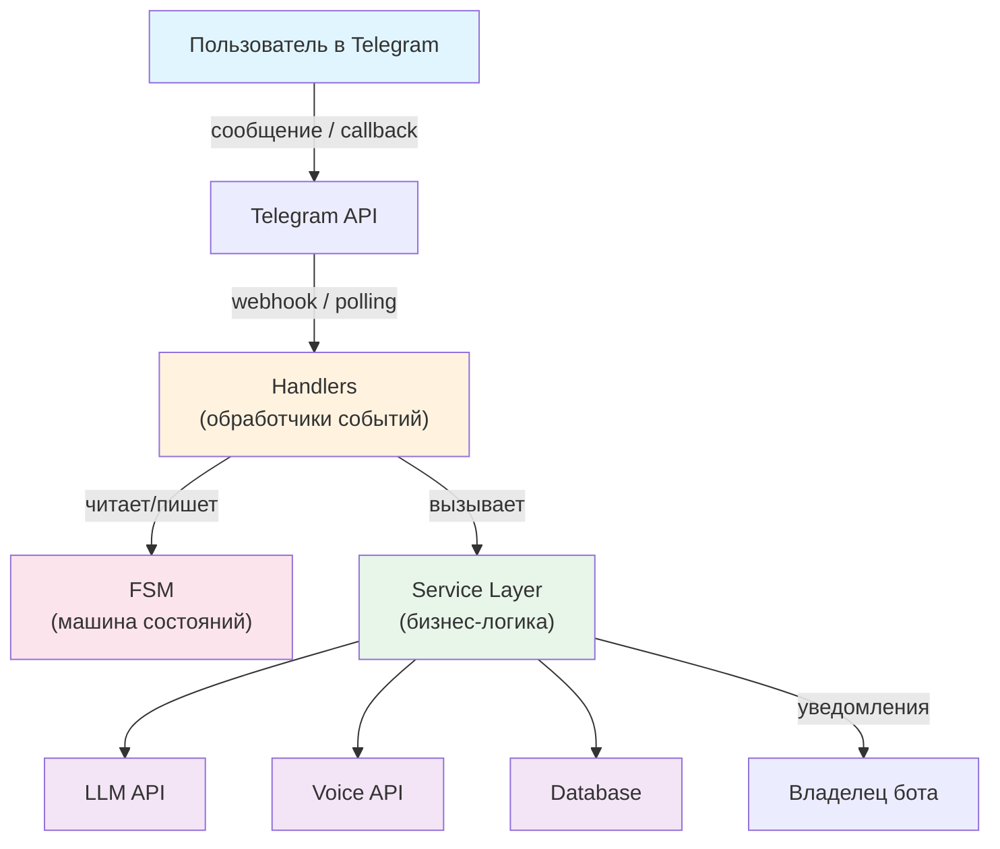
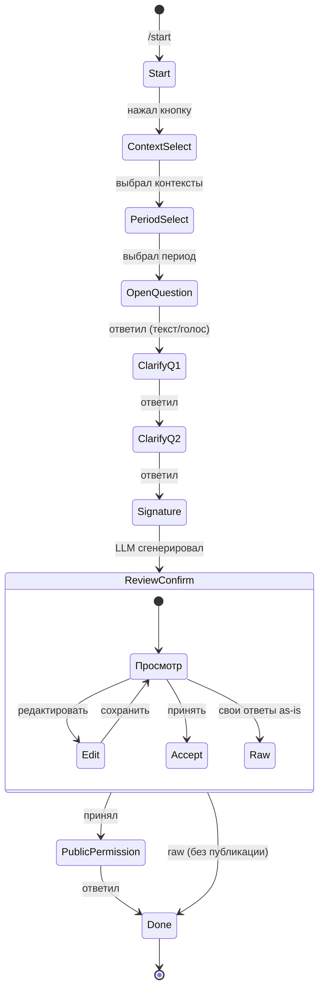
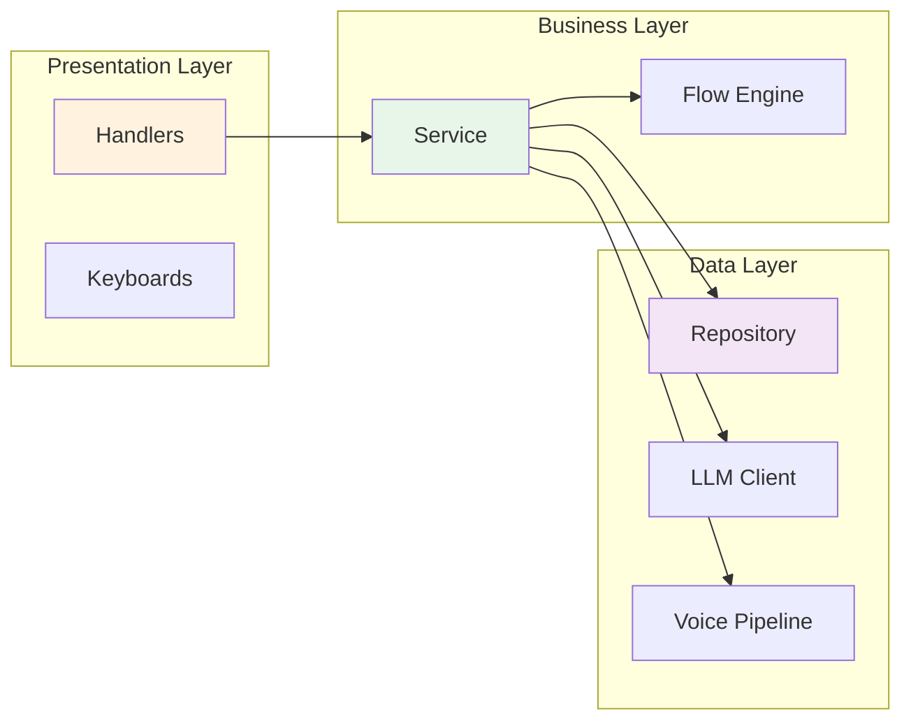
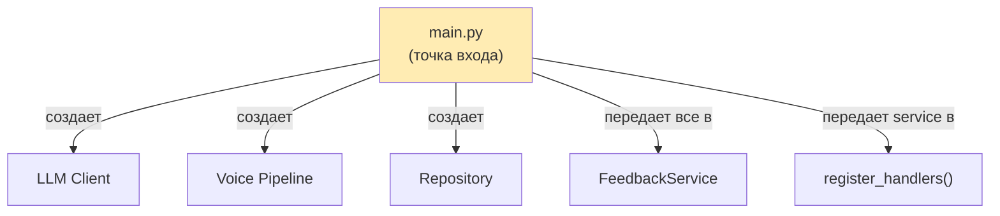
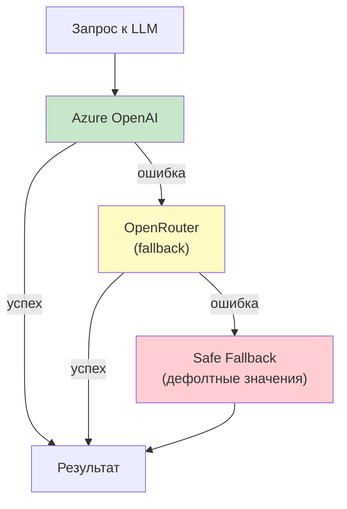
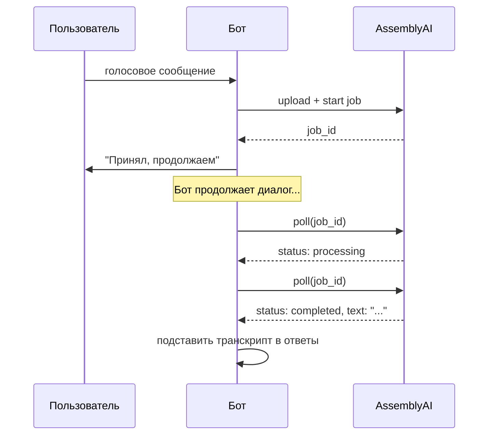
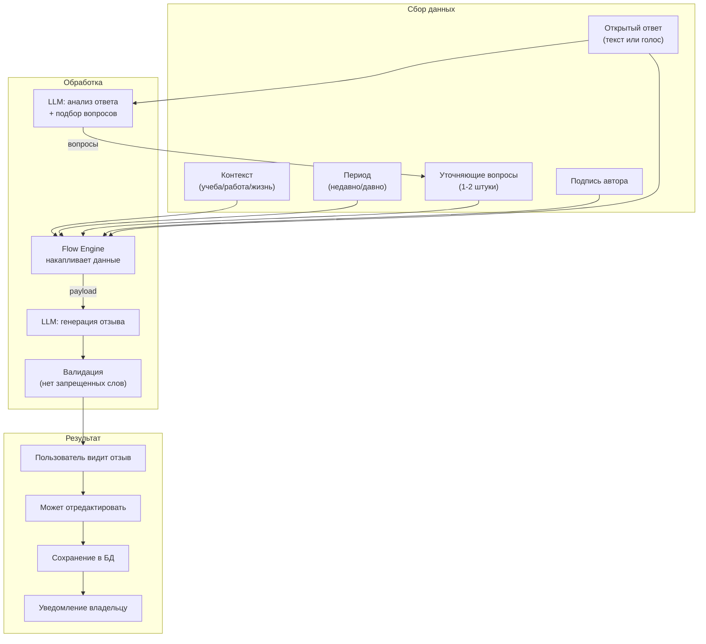
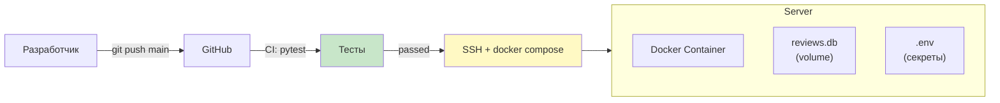

# Архитектура Telegram-бота: принципы и паттерны

> Гайд по архитектуре на примере feedback-бота.
> Фокус на **принципах**, которые применимы к любому боту.

---

## 1. Общая архитектура

Любой нетривиальный бот — это **event-driven приложение** с несколькими слоями:



**Принцип:** Handlers только маршрутизируют. Вся логика — в Service Layer. База, внешние API — за абстракциями.

---

## 2. Finite State Machine (FSM) — сердце любого бота

Бот — это **диалог**, а диалог — это **конечный автомат**. Каждое состояние определяет, какие сообщения бот ожидает и как на них реагирует.



### Принципы FSM

| Принцип | Зачем |
|---------|-------|
| **Одно состояние = один тип ввода** | Бот точно знает, что ожидать от пользователя |
| **Переходы явные** | Нет "магических" переходов, каждый переход — в коде |
| **Состояние хранится per-user** | Каждый пользователь в своей точке диалога |
| **Таймаут сессий** | Забытые диалоги не висят вечно |

### Как это выглядит в коде (aiogram)

```python
# Определение состояний
class FeedbackState(StrEnum):
    START = "start"
    CONTEXT_SELECT = "context_select"
    OPEN_QUESTION = "open_question"
    # ...

# Хендлер привязан к состоянию
@router.message(FeedbackStatesGroup.OPEN_QUESTION)
async def on_open_answer(message, state):
    # обработка ответа
    await state.set_state(FeedbackStatesGroup.CLARIFYING_Q1)
```

---

## 3. Слоистая архитектура (Layered Architecture)



### Принципы

**Handlers (Presentation)** — тонкие. Только:
- Достать данные из сообщения
- Вызвать сервис
- Отправить ответ пользователю
- Переключить состояние FSM

**Service (Business)** — толстый. Вся логика:
- Оркестрация (вызвать LLM, потом сохранить в БД, потом уведомить)
- Валидация результатов
- Управление сессиями
- Retry-логика

**Repository / Clients (Data)** — абстракции над хранилищами и API:
- Не знают про Telegram
- Не знают про бизнес-правила
- Просто делают CRUD / HTTP-запросы

---

## 4. Dependency Injection

Компоненты получают зависимости через конструктор, а не создают их сами:



```python
# main.py — собирает граф зависимостей
llm = FallbackLLMClient(primary=azure_client, fallback=openrouter_client)
voice = VoicePipeline(assemblyai_client)
db = ReviewRepository(db_path)
service = FeedbackService(llm=llm, voice=voice, db=db, notify=send_notification)

register_handlers(dispatcher, service, content)
```

**Зачем:**
- Легко тестировать (подставляешь моки)
- Легко менять реализацию (другая БД, другой LLM)
- Явные зависимости — видно, что от чего зависит

---

## 5. Паттерн Fallback для внешних сервисов

Внешние API падают. Всегда. Нужен план Б:



```python
class FallbackLLMClient:
    def __init__(self, primary, fallback):
        self.primary = primary
        self.fallback = fallback

    async def generate_review(self, prompt, payload):
        try:
            return await self.primary.generate_review(prompt, payload)
        except Exception:
            return await self.fallback.generate_review(prompt, payload)
```

**Принцип:** Три уровня fallback — Primary -> Fallback -> Safe Default. Бот никогда не "падает" для пользователя.

---

## 6. Обработка голоса: Fire-and-Forget + Batch Collect

Голосовые сообщения транскрибируются асинхронно. Это паттерн "отправь и забудь, потом собери":



**Принцип:** Не блокируй пользователя ожиданием. Запусти фоновую задачу, собери результат когда понадобится.

---

## 7. Структура проекта

```
project/
├── bot/                    # Код бота
│   ├── main.py            # Точка входа, сборка зависимостей
│   ├── config.py          # Загрузка конфигурации
│   ├── fsm.py             # Определение состояний
│   ├── flow.py            # Движок сбора данных
│   ├── handlers.py        # Telegram-хендлеры
│   ├── service.py         # Бизнес-логика
│   ├── llm.py             # Клиенты LLM API
│   ├── voice.py           # Голосовой пайплайн
│   ├── db.py              # Работа с БД
│   └── notification.py    # Уведомления владельцу
├── content/               # Тексты, промпты (YAML)
│   ├── texts.yaml         # UI-тексты бота
│   ├── thinking.yaml      # Фразы "думаю..."
│   └── clarify_questions.yaml
├── prompts/               # Системные промпты для LLM (Markdown)
│   ├── generate_review.md
│   ├── rephrase_review.md
│   └── analyze_answer.md
├── tests/                 # Тесты
├── Dockerfile
├── docker-compose.yml
└── pyproject.toml
```

### Принципы организации

| Принцип | Пример |
|---------|--------|
| **Контент отдельно от кода** | `content/` и `prompts/` — не в Python-файлах |
| **Один файл = одна ответственность** | `llm.py` не знает про Telegram, `handlers.py` не знает про SQL |
| **Конфиг из окружения** | `.env` + environment variables, никаких хардкодов |
| **Промпты — отдельные файлы** | Markdown-файлы, легко редактировать без деплоя кода |

---

## 8. Как данные проходят через систему



---

## 9. Ключевые паттерны (шпаргалка)

### Для любого бота

| Паттерн | Что делает | Когда нужен |
|---------|-----------|-------------|
| **FSM** | Управляет диалогом | Любой бот сложнее эхо-бота |
| **Service Layer** | Изолирует бизнес-логику | Когда есть логика сложнее "получил-отправил" |
| **Repository** | Абстракция над БД | Когда есть хранение данных |
| **DI** | Зависимости через конструктор | Всегда (тестируемость!) |
| **Fallback** | Резервные провайдеры | Когда есть внешние API |
| **Protocol/Interface** | Контракт без наследования | Когда у сервиса несколько реализаций |
| **Content Separation** | Тексты в YAML, промпты в MD | Когда хочешь менять тексты без деплоя |
| **Session Timeout** | Автоочистка зависших сессий | Когда храните состояние в памяти |

### Для бота с LLM

| Паттерн | Что делает |
|---------|-----------|
| **Промпты в файлах** | Легко итерировать, без изменения кода |
| **Валидация ответа LLM** | LLM может вернуть мусор — проверяй |
| **Retry с лимитом** | LLM может тупить — повтори 2-3 раза |
| **Thinking indicators** | Покажи "думаю..." пока LLM работает |
| **Temperature control** | Для анализа — низкая, для генерации — средняя |

---

## 10. Деплой



### Принципы деплоя

- **Docker** — воспроизводимое окружение
- **Volume для БД** — данные переживают пересборку контейнера
- **Секреты в .env** — не в коде, не в Docker image
- **CI перед деплоем** — тесты должны пройти
- **Auto-restart** — `restart: unless-stopped`

---

## Итого: минимальный чеклист для нового бота

1. Определи **состояния диалога** (FSM)
2. Раздели на **слои**: handlers / service / data
3. Вынеси **тексты** в YAML/JSON
4. Используй **DI** — всё через конструктор
5. Добавь **fallback** для внешних API
6. Пиши **тесты** с моками зависимостей
7. Деплой через **Docker** + CI
